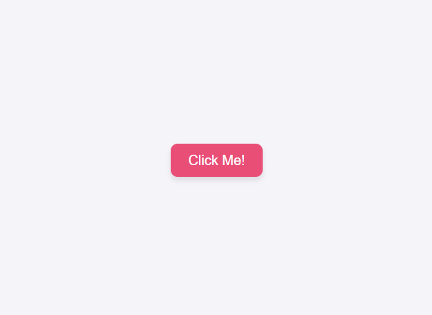
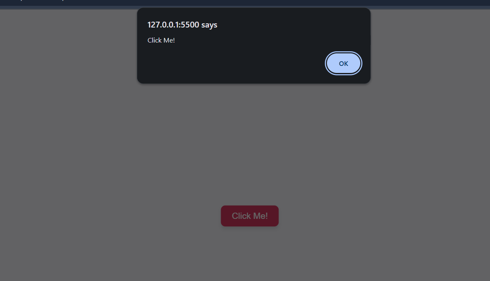

# Alert Button Task

This task demonstrates how to display an alert showing the button's text when the button is clicked. It is implemented using **HTML**, **CSS**, and **JavaScript**.

---

## **Features**

- Displays a button on the webpage.
- When the button is clicked, an alert pops up showing the text of the button.
- Simple styling with hover effects for better user experience.

---

## **Files Structure**

```
AlertButton/
├── index.html
├── styles.css
├── script.js
├── README.md
└── Screenshots/
    ├── initial.png
    └── onClick.png
```

---

## **HTML (`index.html`)**

- Contains a single button with `id="alert-button"`.
- Includes links to the CSS and JavaScript files.

---

## **CSS (`styles.css`)**

- Centers the button vertically and horizontally using Flexbox.
- Adds padding, font styling, rounded corners, and shadow to the button.
- Includes a hover effect: color change and slight zoom.

---

## **JavaScript (`script.js`)**

- Selects the button using `getElementById`.
- Adds a `click` event listener.
- Uses `alert(button.textContent)` to display the button’s text.

---

## **How to Run**

1. Open `index.html` in a web browser.
2. Click the button labeled **"Click Me!"**.
3. An alert will display with the text: `Click Me!`.

---

## **Screenshots**

| Initial State                       | After Clicking Button                |
| ----------------------------------- | ------------------------------------ |
|  |  |

---

## **Notes**

- This task is useful for understanding **event listeners** and **DOM text manipulation** in JavaScript.
- You can extend this by adding multiple buttons with dynamic alerts for each.
