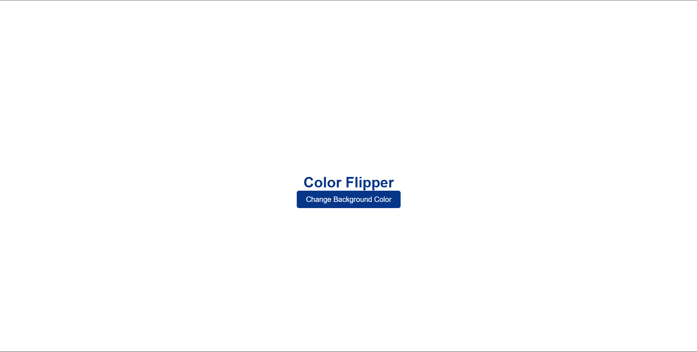
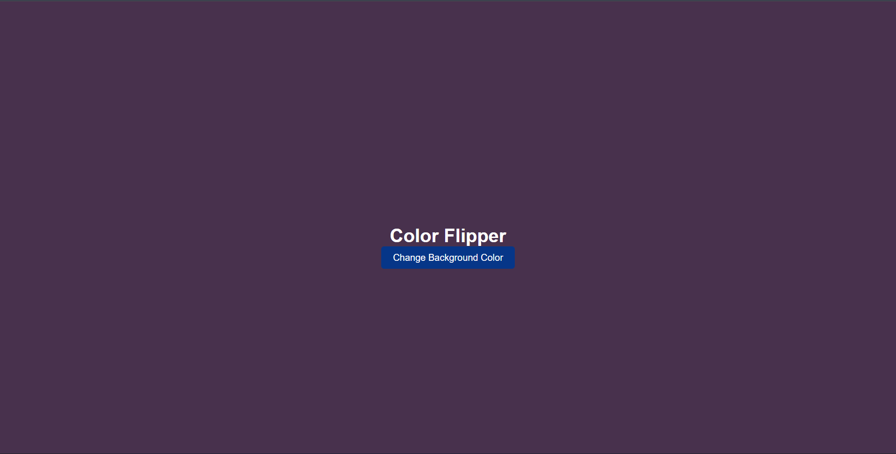

# BackgroundColorChanger

## Project Overview

**BackgroundColorChanger** is a simple JavaScript project that allows users to dynamically change the background color of a webpage by clicking a button. Additionally, the heading color adapts based on the background to ensure readability. This project demonstrates **DOM manipulation**, **event handling**, and **random color generation** in JavaScript.

---

## Features

1. **Dynamic Background Color**

   - Each click on the button generates a random RGB color.
   - The background changes instantly to the new color.

2. **Adaptive Heading Color**

   - Heading (`<h1>`) text color changes based on the background:
     - Initially blue when the background is white.
     - Turns white after the first click or when the background is not white.

3. **Smooth User Interaction**
   - Button is styled with hover effects and transitions.
   - Centered heading and button for clean UI.

---

## Technologies Used

- **HTML5** – Structure of the webpage.
- **CSS3** – Styling the heading and button with responsiveness and hover effects.
- **JavaScript (ES6)** – DOM manipulation, event listeners, and random RGB generation.

---

## File Structure

```
BackgroundColorChanger/
├── index.html          # Main HTML file
├── styles.css          # CSS styles for layout and design
└── script.js           # JavaScript for background and heading color logic
|-Screenshots/
    |-output1.png
    |-output2.png

```

# My Project

## Screenshots

### Screenshot 1

### Screenshot 1



### Screenshot 2



---

## How It Works

1. The **page loads with a white background** and a blue heading.
2. When the user clicks the **"Change Background Color"** button:
   - Three random numbers between 0–255 are generated (for R, G, B).
   - A random color string in the format `rgb(r, g, b)` is applied to `document.body.style.backgroundColor`.
   - The heading color adapts:
     - Remains blue on the first click if the background was initially white.
     - Turns white for all subsequent clicks or non-white backgrounds.
3. The user can keep clicking the button to see a wide variety of colors.

---
