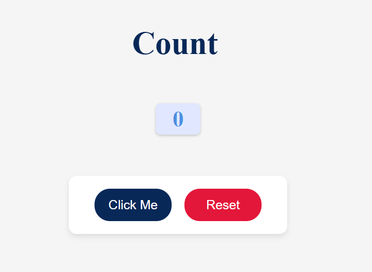
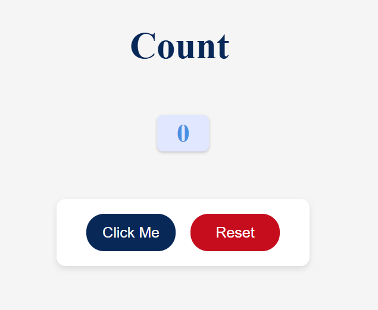
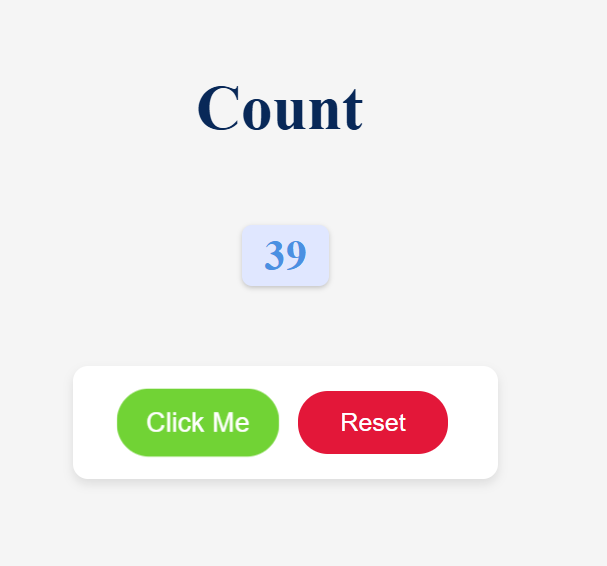

# Counter Button with Random Color

## Project Overview

This is a simple **Counter Button** project built using HTML, CSS, and JavaScript.  
The project demonstrates:

- Incrementing a counter value when a button is clicked.
- Resetting the counter to zero.
- Dynamically changing the **counter display color** and **button background color** on click.
- Basic styling and UI enhancements like hover effects and smooth transitions.

This project helps in understanding **DOM manipulation**, **event handling**, and **dynamic styling** using JavaScript.

---

## Features

1. **Click Counter**

   - Clicking the **"Click Me"** button increases the counter displayed in real-time.
   - Each click triggers a **random color change** for the counter number.

2. **Reset Functionality**

   - Clicking the **Reset** button sets the counter back to 0.
   - Counter display resets to initial styling.

3. **Dynamic Button Styling**

   - The **Click Me** button background changes to a random color on each click.
   - Smooth transition effects are applied to both counter and buttons.

4. **Responsive Layout**
   - Elements are centered vertically and horizontally.
   - Hover effects enhance user experience.

---

## Folder Structure

```
Counter Button/
│
├── index.html # Main HTML page
├── styles.css # CSS for layout, counter display, and buttons
├── script.js # JavaScript logic for increment, reset, and color changes
├── README.md # Project documentation
├── Screenshots/ # Screenshots demonstrating functionality
│ ├── initial.png # Counter at initial state
│ ├── reset.png # After clicking Reset
│ └── buttonClicked.png # After clicking "Click Me" button

```

## Screentshots

### Initial State



### After Clicking Reset



### After Clicking "Click Me" Button


