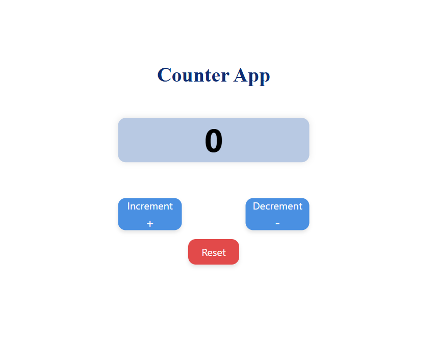
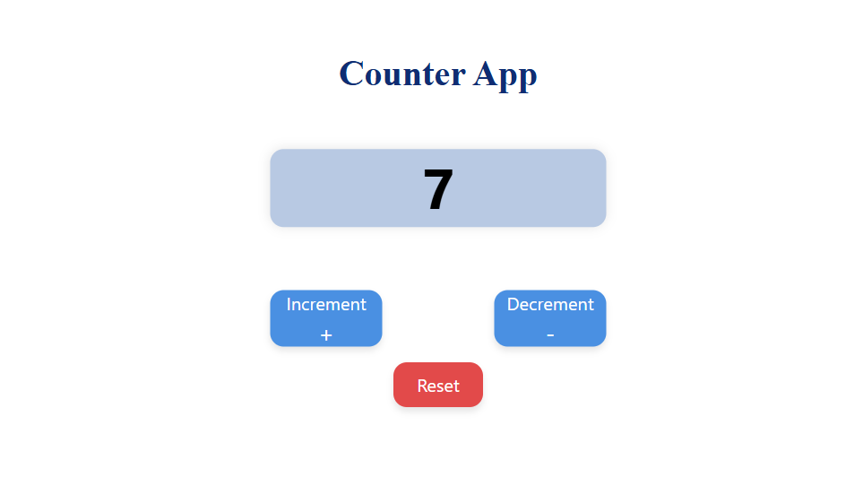
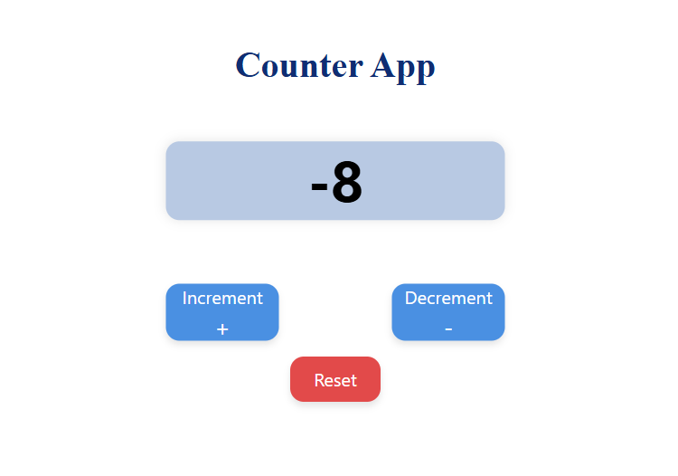
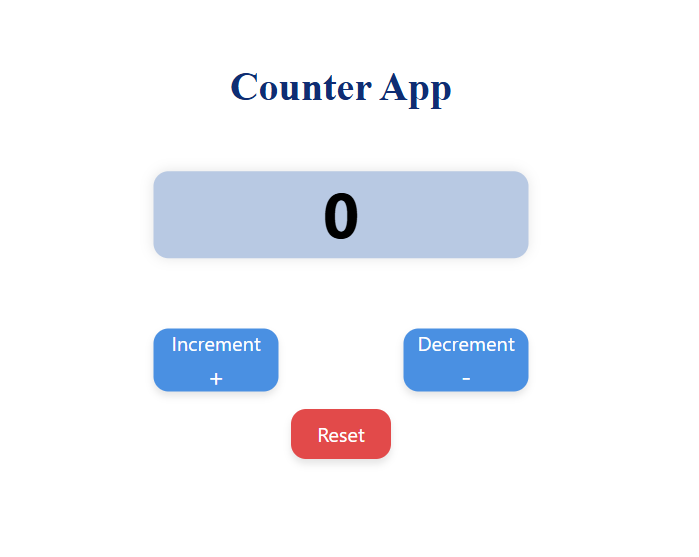

# Counter App

This is a simple **Counter App** built using HTML, CSS, and JavaScript. It allows the user to increment, decrement, and reset a numeric counter. The app features interactive buttons and a visually appealing interface.

---

## Features

1. **Increment Button (+)**

   - Increases the counter value by 1 on each click.
   - Shows a "+" symbol below the text for better UI clarity.

2. **Decrement Button (-)**

   - Decreases the counter value by 1 on each click.
   - Shows a "-" symbol below the text.

3. **Reset Button**

   - Resets the counter to `0`.
   - Displayed slightly below the Increment/Decrement buttons for clear separation.

4. **Dynamic Display**

   - The counter value is displayed in a large, bold font in the center of the page.
   - Updates immediately on button click.

5. **Responsive Styling**
   - Buttons and display are centered on the page.
   - Hover effects are included for better interactivity.

---

## Folder Structure

```
CounterApp/
├── index.html
├── styles.css
├── script.js
├── README.md
└── Screenshots/
    ├── initial.png
    ├── incremented.png
    ├── decremented.png
    └── reset.png

```

---

## How to Use

1. Open `index.html` in a browser.
2. Use the buttons to interact with the counter:
   - **Increment**: Adds 1 to the counter.
   - **Decrement**: Subtracts 1 from the counter.
   - **Reset**: Resets the counter to 0.

---

## Screenshots

  
_Counter at 0._

  
_Counter after clicking Increment._

  
_Counter after clicking Decrement._

  
_Counter reset to 0._
