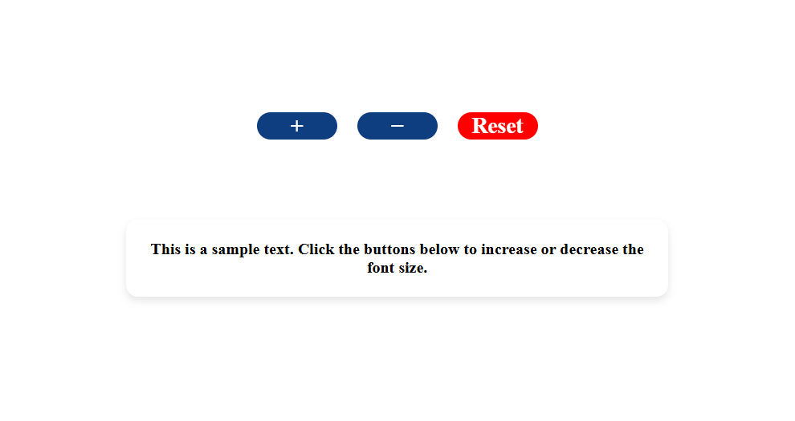
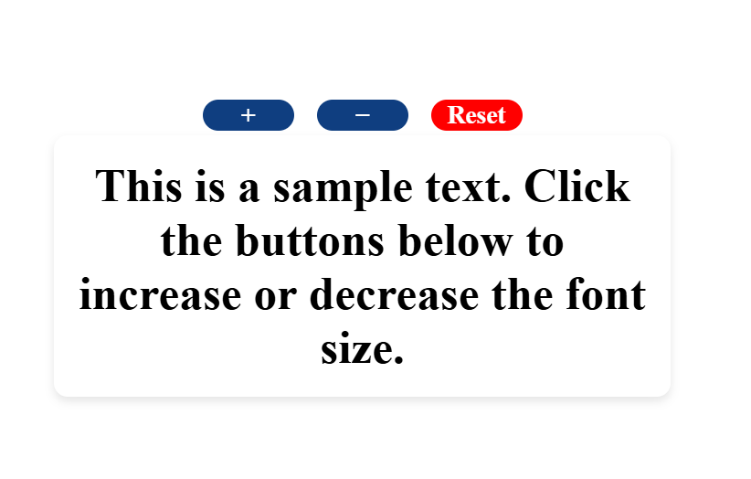
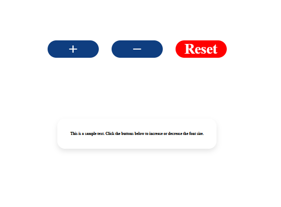

# DynamicFontResizer

## 📖 Project Overview

**DynamicFontResizer** is a simple web-based project that allows users to **increase**, **decrease**, and **reset** the font size of text dynamically using buttons.  
It demonstrates core concepts of **HTML**, **CSS (card design, button styling, shadows)**, and **JavaScript DOM manipulation**.

---

## 🚀 Features

1. **Interactive Buttons**

   - `+` button increases font size by 5px.
   - `-` button decreases font size by 5px.
   - `Reset` button restores the font size to default (16px).

2. **Modern UI Styling**

   - Text displayed inside a **card-like container** with shadow and rounded corners.
   - Buttons styled with hover effects and distinct colors.
   - Responsive and centered layout using **Flexbox**.

   ***

## ⚙️ How It Works

1. Open `index.html` in your browser.
2. Click:
   - **"+"** to increase text size.
   - **"–"** to decrease text size.
   - **"Reset"** to restore default font size.
3. The font size updates dynamically with smooth changes.

---

---

## 💻 Technologies Used

- **HTML5** – Structure of the web page.
- **CSS3** – Styling, card UI, button effects, flexbox layout.
- **JavaScript (ES6)** – Event handling and DOM manipulation.

---

## 📂 Project Structure

FontSizeChanger/
│── index.html # Main HTML file
│── styles.css # CSS styling
│── script.js # JavaScript logic
│── README.md # Project documentation
│── Screenshots/ # Screenshots for README
│ ├── initial.png
│ ├── fontIncreased.png
│ ├── fontDecreased.png
│ └── reset.png

3. **Screenshots**

   - Initial View  
     

   - After Increasing Font  
     

   - After Decreasing Font  
     

   - After Reset  
     

---
