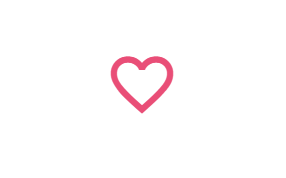

# Like Toggle Button Project

This is a simple **Like Toggle Button** web project where a heart icon toggles between "liked" (filled heart) and "unliked" (outline heart) states when clicked. Additionally, a status text appears below the heart to indicate whether the button is liked or unliked.

---

## Features

1. **Heart Toggle Button**

   - Uses the **Google Material Icons** library for heart icons.
   - Displays an **outline heart** (`favorite_border`) initially.
   - Changes to a **filled heart** (`favorite`) when clicked (liked state).
   - Clicking again toggles back to the outline heart (unliked state).

2. **Dynamic Status Text**

   - Displays "Liked!" when the heart is clicked and in the liked state.
   - Displays "UnLiked!" when toggled back to unliked state.
   - Text has dynamic styling (background color and text color changes with state).

3. **Hover Effects**
   - Heart icon enlarges slightly on hover for a **pop-up effect**.
   - Smooth color transitions on toggle for a visually appealing effect.

---

## External Libraries Used

- **Google Material Icons**
  - Used for the heart icon.
  - CDN Link:
    ```html
    <link
      href="https://fonts.googleapis.com/icon?family=Material+Icons"
      rel="stylesheet"
    />
    ```
  - Benefits: Provides high-quality, scalable vector icons with built-in outlined and filled variants.

---

## Screenshots

| Initial State                       | Liked State                     | Unliked State                       |
| ----------------------------------- | ------------------------------- | ----------------------------------- |
|  |  |  |

## Folder Structure

Like Toggle /
│
├── index.html # Main HTML page
├── styles.css # CSS styling for button, text, and layout
├── script.js # JavaScript logic for toggling heart and text
├── README.md # Project documentation (this file)
└── Screenshots/ # Folder containing screenshots
├── initial.png # Initial state (outline heart)
├── liked.png # Liked state (filled heart)
└── unliked.png # Unliked state after toggle
