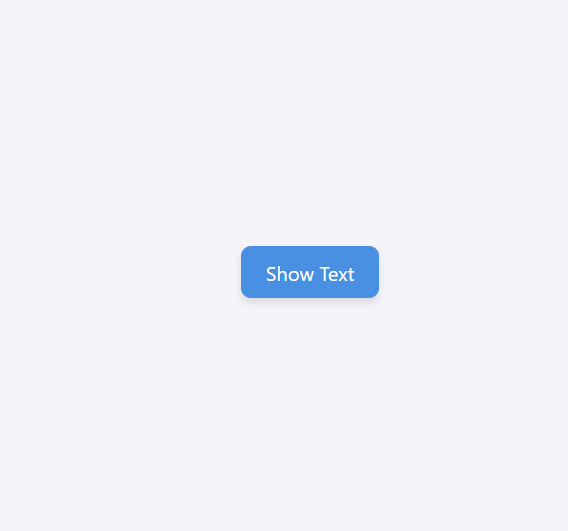
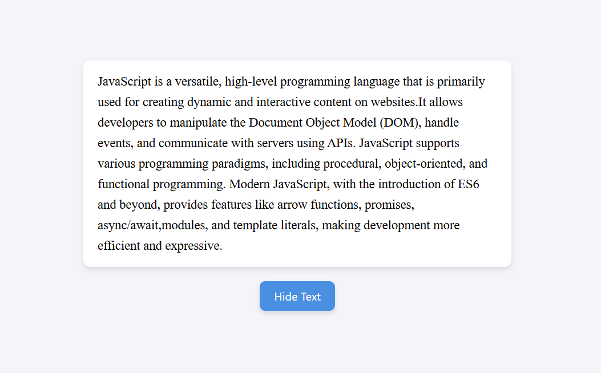

# Paragraph Toggler

This project is a simple **Paragraph Toggler** built with **HTML, CSS, and JavaScript**. It demonstrates how to dynamically show and hide content on a webpage using JavaScript and provides a clean and interactive user interface.

---

## Features

1. **Show/Hide Paragraph**

   - Initially, the paragraph is hidden.
   - Clicking the **Show Text** button displays the full paragraph.
   - Clicking the **Hide Text** button hides the paragraph again.

2. **Dynamic Button Text**

   - Button text changes based on the current state:
     - **Show Text** when paragraph is hidden.
     - **Hide Text** when paragraph is visible.

3. **Responsive Design**

   - The paragraph and button are centered on the page.
   - Works on all screen sizes using flexible layout and viewport height.

4. **Styling and Effects**
   - Paragraph has padding, rounded corners, and shadow for better readability.
   - Button has hover effects and subtle scaling animation for improved interactivity.

---

## Folder Structure

```
ParagraphToggler/
├── index.html
├── styles.css
├── script.js
├── README.md
└── Screenshots/
    ├── initial.png
    └── shown.png

```

---

## How to Use

1. Open `index.html` in your preferred web browser.
2. Click the **Show Text** button to reveal the paragraph.
3. Click **Hide Text** to hide the paragraph again.

---

## Screenshots

  
_Paragraph is hidden by default._

  
_Paragraph displayed after clicking Show Text._
