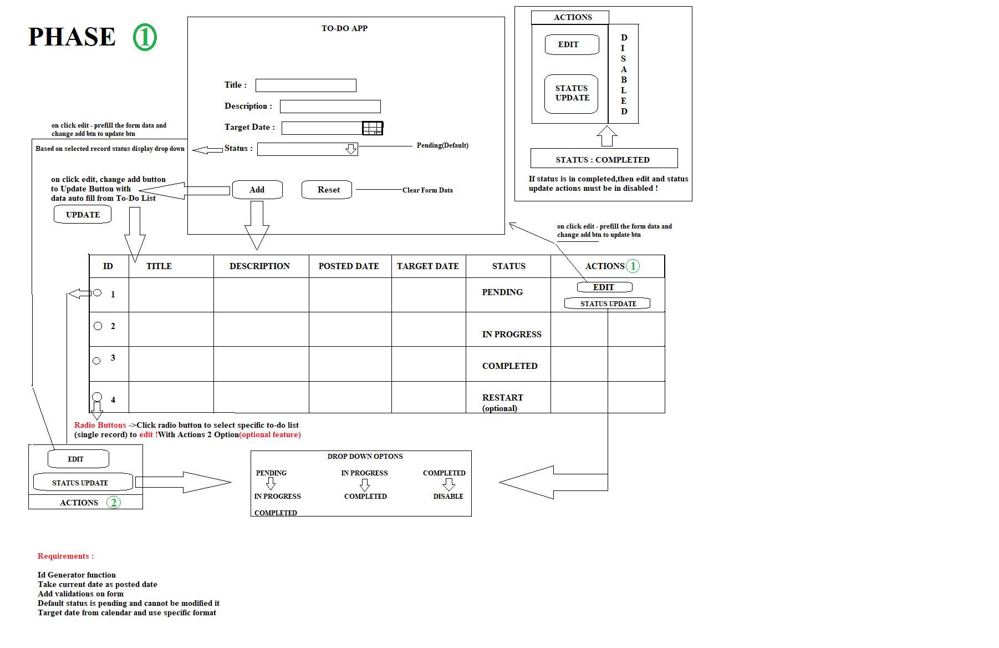

# To-Do App - Mini Project (Phase 1)

## Project Overview

This is a simple **To-Do App** built using **HTML, CSS, and JavaScript**. The app allows users to manage their tasks by adding, editing, updating status, and viewing task details in a tabular format. This project is implemented as a **Phase 1 prototype**, and it is intended to practice DOM manipulation, form handling, and basic client-side JavaScript functionality.

**Project Path:**  
`C:\Users\yegir\OneDrive\Attachments\Pictures\Desktop\Lokesh_10336\MiniProjects\To-Do App`

**Files included in the project:**

- `index.html` – Main HTML structure of the app.
- `styles.css` – CSS styling for the app, including responsive layout, table styling, and form design.
- `app.js` – JavaScript logic for adding, editing, updating status, and rendering tasks.
- `README.md` – Project documentation (this file).

---

## Features Implemented (Phase 1)

1. **Task Form**

   - Form fields for:
     - Task Title
     - Task Description
     - Due Date
     - Status (Pending, In Progress, Completed)
   - `Add Task` button to add a new task.
   - `Reset` button to clear the form.
   - Form fields are dynamically populated when editing a task.
   - When a task is updated with **Completed** status, the form resets and the `Update Task` button switches back to `Add Task`.

2. **Task List**

   - Tasks are displayed in a **table** format with the following columns:
     - ID
     - Title
     - Description
     - Posted On
     - Due Date
     - Status
     - Actions
   - Each task can be **edited** by clicking the `Edit` button.
   - A **“No tasks available”** message is displayed when the task list is empty.

3. **Task Editing**

   - Edit functionality:
     - Clicking the `Edit` button populates the form with existing task details.
     - The Add Task button changes to **Update Task** while editing.
     - Updates are reflected immediately in the table.
   - Edited date is displayed alongside the original posted date.
   - If task status is updated to **Completed**, the form resets and editing is disabled.

4. **Task Data Management**

   - Tasks are stored in a **JavaScript array**.
   - Each task has the following properties:
     - `id` (auto-incremented)
     - `title`
     - `description`
     - `postedDate`
     - `editedDate` (if updated)
     - `dueDate`
     - `status`

5. **Update Status**

   - Each task row includes a dropdown to update the status:
     - Pending → In Progress → Completed
   - A confirmation dialog is shown before changing status.
   - Once updated, changes are reflected in real-time in the table.
   - If status is set to **Completed**, the row’s dropdown and edit button are disabled.

6. **Responsive Design**
   - Form and table are styled to be **mobile-friendly**.
   - CSS includes:
     - Underline style for inputs
     - Button styles
     - Table styling with fixed layout and ellipsis for long text
     - Action buttons for each task

---

## Remaining Features for Phase 1 Completion

1. **Form Validations**

   - Ensure all fields are properly validated.
   - Display error messages below each field.

## Optional Features (Future Enhancements)

1. **Radio Button Selection for Single Task Actions**
   - Add radio buttons to each task row to select a specific task.
   - When a task is selected, a separate action block appears below or beside the table.
   - The action block contains **Edit** and **Update Status** buttons for the selected task.
   - This provides a cleaner alternative to having action buttons in every row and centralizes operations.

---

## How to Run the Project

1. Open the project folder in your file explorer.
2. Open `index.html` in any modern web browser (Chrome, Firefox, Edge).
3. Use the form to add a new task.
4. Edit tasks by clicking the **Edit** button.
5. Reset the form by clicking the **Reset** button.
6. Update task status using the dropdown in the task list.
7. Observe the task list update in real-time.

---

## Project Screenshots

## Notes

- This project is entirely **client-side**, using vanilla JavaScript. No backend or database is used.
- Tasks are stored **temporarily in memory**. Refreshing the page will reset all tasks.
- Future phases may include:
  - Task validations
  - Persistent storage (localStorage or backend database)
  - Additional features like task filtering and sorting

## Project Folder Structure

To-Do App/
│
├── index.html # Main HTML page  
├── styles.css # CSS styles for form, table, buttons, etc.  
├── app.js # JavaScript logic for adding, editing, updating status, rendering tasks  
├── README.md # Project documentation  
└── assets/ # Optional folder for images or icons
